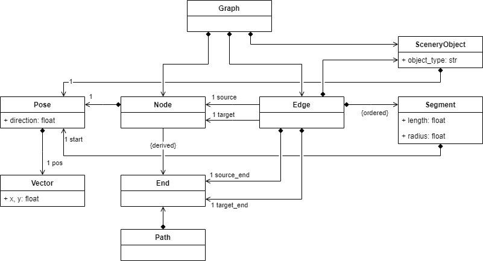
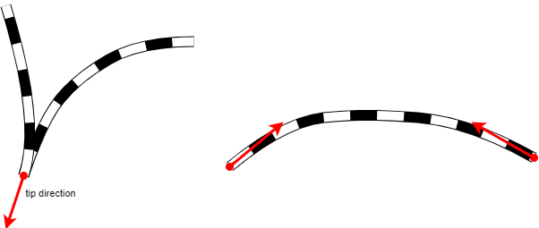
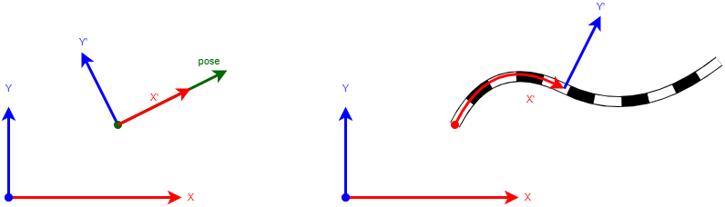

= Library for Route Creation

This is a short documentation for the `routecreation` Python package. It provides the following modules

* `geometry`: 2D coordinate transformation
* `railgraphs`: railway maps as graphs
* `openrails`: Export as OpenRails route files
* `osm_reader`: Import from OpenStreetMap XML files
* `plotting`: Helpers for plotting

== Data Structures

Rail networks are described as directed graphs. A _graph_ consists of _nodes_ conected by _edges_; each edge has a _source_ and a _target_ node. In terms of railway networks, nodes with more than two incident edges are switches. Currently, the library does not model crossings. 

For the navigation in a railway graph it is necessary to determine in which direction a train travels along an edge. Therefore we introduce the notion of an _end_. Each edge has two ends, one on source and one on target side. Then, we can describe a directed _path_ in a graph as a sequence of ends, where each end in the sequence indicates where we start to traverse an edge. 

One of the ends connected to a switch is called the _tip_. This is the end from which it is possible to travel to each of the other connected ends.  From non-tip ends, it is only possible to travel to the tip. Note, that the RailGraphs API urrently determines the tip of a switch from the geometric graph layout. The list of incident ends (returned by the `ends()` method of the node class) starts with the tip end.  

Additionally to the logical structure, the RailGraphs library allows to describe the geometry of a railway map in a 2D Cartesian coordinate system. Each node has a position (a 2 dimensional _vector_) and a _direction_. Directions are measured in radiants counter-clockwise to the x-axis. A tuple of a position and a direction is called a _pose_. For a node with one incident edge, the node direction shall point in direction of the incident edge, towards the other end. For a switch, the node driection is the direction of the tip. 

The geometrical layout of edges is described as a sequence of _edge segments_. Each segment has a _start_ pose, a _length_ and a _radius_. A zero radius indicates a straight edge segment, a negative radius indicates a left curve arc, and a positive radius indicates a right curve arc segment.  

From this layout information, the API automatically derives the _start_ and _end_ poses of edges and segments, the edge length, and the tip of a switch. Note that for the latter the node and segment directions need to be consistent. 

Everything that is not a node or an edge is described as a _scenery object_. Each scenery object has a _posee_, an _object type_, and optionally a _name_. Scenery objects can be attached to a specific edge. In this case, their position is specified relative to that edge and, in case the edge layout is changed, they are moving with the edge. The `openrails` module currently defines the object type constant `SIGNAL_TYPE` for signals. Furthermore, scenery objects can have additional user-defined attributes. They can be supplied as additional parameters in the constructor and are stored in the `attrs` dictionary of the object. Currently, the OpenRails export uses some custom attributes, see below.  

== Transformations

The API provides methods to transform between local and global coordinates. Therefore, poses, edges, segments, paths, and scenery objects provide methods `to_local()` and `to_global()` that translate poses and positions from local to global coordinates. The local coordinate systems are defined as follows.

Poses, nodes, and scenery objects:: This is an affine transformation consisting of translation and rotation. The origin is at the _position_, and the x-axis points in _direction_ of the object. 

Edges, Segments, and paths:: This is similar to the road-centric coordinate system defined, e.g., in OpenDRIVE. The origin is at the _start_ position, the x-coordinate is the way traveled along the object, and the y-coordinate is the distance to the object. For straight segments/edges/paths this results in an affine transformation. 

== Manually Building Routes

The RailGraphs library provides some utility functions that make navigation and construction of routes easier. The `add_edge(...)` methods of nodes and ends allows to add another edge to the current node, respectively end. The new edge (or segment) is added at the position and in direction of the node or end on that the method was called. Providing a negative edge length allows to extend backwards from the current point. The new end of the edge is returned, which allows to easily create a sequence of edge segments. 

[source,python]
----
from railgraphs import Graph, Node
from geometry import Vector, Pose

graph = Graph()

# create the start node
start = Node(Pose(Vector(-1000.0, 0.0)), graph)

# create an edge consisting of three segments, store the end node
switch_tip = start.add_edge(500.0).add_edge(100.0, 100.0).add_edge(100.0)

# continue straight, with a new edge
switch_tip.add_edge(200.0, extend_edge=False)

# build a turnout
end = switch_tip.add_edge(200.0, 100.0).node()
----

== Exporting Routes for OpenRails

The `ORWriter` class from the `openrails` package is used to save the railway graphs as OpenRails route folders. The `ORWriter` constructor takes as arguments the destination directory and the graph to be exported.

[source,python]
----
from railgraphs import Graph, Node, find_shortest_path
from geometry import Vector, Pose
from openrails_data import ORWriter
graph = Graph()

# build the graphe here as in the above example
# ...

# create the ORWriter instance
writer = ORWriter(r"C:\git-repos\openrails-content\Demo Model 1\ROUTES\Straight", graph)

# write the route files
writer.write_all()

# write path files to place trains on
writer.write_path_file('0', 'main', 'start', 'end', find_shortest_path(start, end))
writer.write_path_file('1', 'reverse', 'end', 'start', find_shortest_path(end, start))
----

=== Special Attributes for Scenery Objects

The `ORWriter` uses the following special attributes when writing scenery objects to the world file.

`shapefile`:: file name of the shape to use
`animated`:: Indicate whether the object shall be flagged as animated. This is required if the object 
             shall be moved during the simulation, or if the 3D shape is animated. 
`classification`:: The object class to assign for LiDAR semantic labeling (see LiDAR sensor documentation). This overrides the default classification. 
`z`:: Object position on the up-axis (above ground level)
`render`:: If this is set to False, the object will not be included in the OpenRails World definition and therefore not be simulated or rendered by OpenRails. Useful for objects that are required to have a position in the world, but do not need to be included in the OpenRails simulation, e.g. trackside sensors evaluated outside OpenRails. Default is True.
