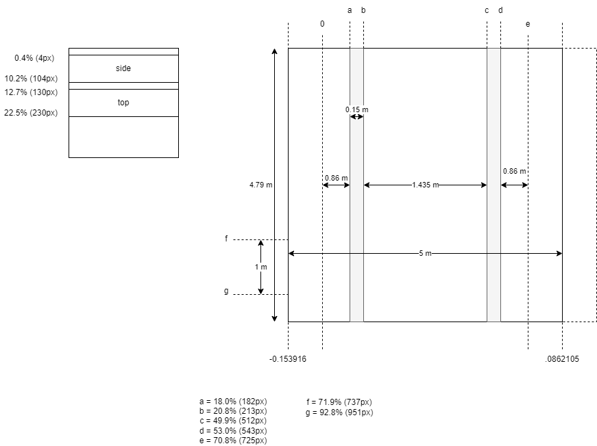

= Textures That Need Replacements

To the best of our (the authors of the simulation API) knowledge, the routes for free download are licensed for non-commercial, personal use only.

There seems to be a set of standard textures and 3D shapes that seem to be shipped with every route. This includes, e.g., the ground texture, and track textures and shapes. The origin of these textures/3D models cannot clearly be traced back to an author. This also includes the assets shipped with TSRE (route editor), i.e., ground texture, trees, signals, streets. In order to be legally more safe, these standard files have been replaced in the route template used by this simulation API. 

The 3D models shipped with free content are quite coarse and (signals, roads) do not adhere to German standards. Therefore, German users of the simulation environment have to replace them anyway. You can either buy them or create them yourself using Blender, and they are not covered by this document. 

However, there are a few standard textures that are used by every route which have been replaced. This document describes these textures. 

== General

The shipped textures use the proprietary ACE format that is special to MS Train Simulator and adopted by OpenRails for compatibility. However, OpenRails also supports textures in the DDS format that is supported by Gimp and Imagemagick. If an ACE file cannot be found, OpenRails automatically falls back to a DDS texture file name with same base name. Hence, we can create custom DDS texture files as drop-in replacement for proprietary textures. 

== Track Textures

The dynamic tracks in OpenRails use two textures named `acleantrack1.ace` and `acleantrack2.ace` located in the route's `TEXTURES` folder. The former is used for the track ballast and sleepers, and the latter for the steel rails. 

//todo: do we have a source for this image?

The above image describes the layout of the track textures. We assume a texture size of 1024x1024 pixels. The `acleantrack1` texture displayed on the right shows a track segment of approx. 5m length and 5m width. Note, that the track segment is not centered on the texture image. 
The `acleantrack2.ace` texture is displayed on the left. The upper part of the texture is used for the rail tops and the bottom part for the sides. 

== Terrain Textures

The terrain (i.e., the ground) is patched with a texture located at `terrtex/terrain.ace` in the route folder. 

In the standard routes generated by TSRE (and our intern `routecreation` library), the texture is mapped to a square area of 128m length and width. So, a high resolution texture shall be used. In a 1024x1024 texture, a single pixel is mapped to an area of 12.5cm times 12.5cm. 

TODO: There seem to be alternative textures for winter. 

TODO: Textures for water tiles. 

== Other Environment Textures

TODO: It seems that textures in `envfiles/textures/` folder are currently not used by OpenRails. 
