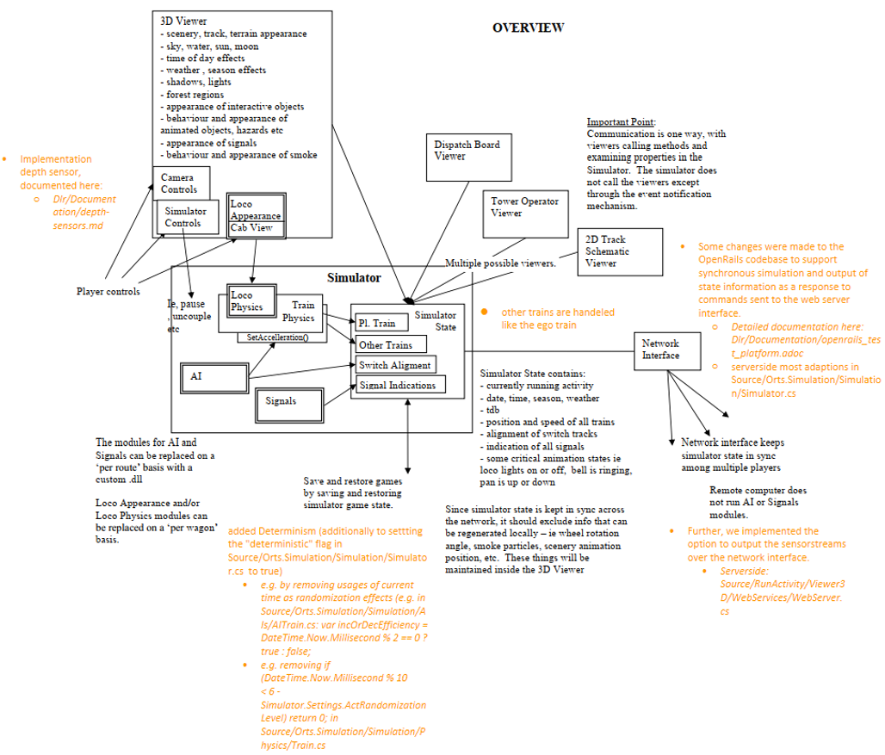

# OpenRails for Simulation

## About the software
This is a forked and updated software from [OpenRails](https://github.com/openrails/openrails). 

It extends OpenRails to allow communication between a client (written in python) with the OpenRails server via the HTTP protocol.
Using these HTTP commands that are sent to the OpenRails server, it acts as simulation client with different purposes.

This software is dedicated towards:
- researchers,
- teachers or students in Systems Engineering courses,
- persons with strong passion for railway domain.

## Installation
### Build OpenRails solution
Follow the installation steps of OpenRails (involving building OpenRails solution). 
They can be found at **Docs/Building.md**. You can check if the installation works by trying to open OpenRails game at location **Program/OpenRails.exe**.

### Set up Python 
- Install the needed Python packages as listed in **requirements.txt**.
- Add Dlr to your PYTHONPATH

### Environment variables
In Dlr\config\constants.py the name of the following environment variables are defined. They can be added either globally (My Computer -> Settings -> Environment variables), or in a console before running e.g. a demo script (set OR_CONTENT_BASE=<your_path>).

- **OR_CONTENT_BASE**: is the absolute path to a folder containing the tracks, the routes and the train models. These can be found freely in the [OpenRails content browser](https://www.openrails.org/download/explore-content/index.html). For running our demo scripts, you need at least **Demo Model 1**.
- **OR_EXEC_DIR**: is the absolute path to the folder with the built executable from the solution of OpenRails (the file used to open the game). It will be the absolute path pointing to the folder **Program**.

The success of the installation can be checked by running any of the provided demo scripts (see below).

## Documentation
see [Documentation](Dlr/index.adoc).

## Demos
We provide three demo scripts (**Dlr/demos/*.py**), where the ego train is the system under test (SUT).
### Prerequisites
After following the [installation instruction](#Installation), you need some OpenRails content, e.g. [Demo Model 1](https://www.openrails.org/download/explore-content/index.html), to run the demos.

## Use-case
A example use case explaining how this software package can be used is also published in a paper presented at the conference VEHITS 2025 ([A Scenario-Based Simulation Framework for Testing of Highly Automated Railway Systems](https://www.scitepress.org/PublicationsDetail.aspx?ID=0+yyTz5j0eA=&t=1) by Michael Wild, Jan Steffen Becker, Carl Schneiders, Eike Möhlmann. DOI: 10.5220/0013286600003941). It can also be found in DLR's [eLib](https://elib.dlr.de/212746/).

## Contributors 
The contributors of this package are:
- Michael Wild (Institute of Systems Engineering for Future Mobility, German Aerospace Center),
- Jan Steffen Becker (Institute of Systems Engineering for Future Mobility, German Aerospace Center),
- Carl Schneiders (Institute of Systems Engineering for Future Mobility, German Aerospace Center),
- Eike Möhlmann (Institute of Systems Engineering for Future Mobility, German Aerospace Center),
- Jakob Kampers (Institute of Systems Engineering for Future Mobility, German Aerospace Center),
- Anda Buinoschi-Tirpescu (Institute of Systems Engineering for Future Mobility, German Aerospace Center).

We acknowledge the help and support received from the **Institute of Systems Engineering for Future Mobility, German Aerospace Center**.

## License

[GPL v3](https://www.gnu.org/licenses/gpl-3.0.html)

You use OpenRails for Simulation entirely at your own risk. It is intended for entertainment and scientific research purposes only and is not suitable for professional applications.
